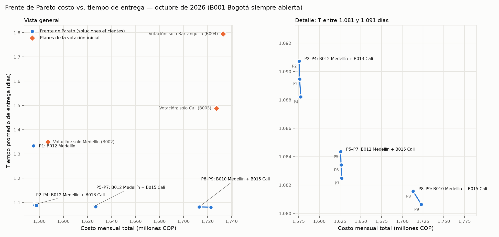

# Optimización multiobjetivo: expansión logística de una importadora

Exposición del curso **Aprendizaje Automático, MCDA 2026-2 (EAFIT)**. Tema: *multi-objective optimization*.

Una importadora colombiana recibe **100.000 pedidos al mes**, pero su bodega de Bogotá solo puede despachar 55.000. Puede abrir **hasta 2 bodegas nuevas** entre 99 candidatas, y tiene dos metas que compiten entre sí:

1. **Minimizar el costo mensual C:** costo fijo de las bodegas, operación por pedido, abastecimiento desde los puertos de Cartagena y Buenaventura, y distribución a los clientes.
2. **Minimizar el tiempo promedio de entrega T** a 60 zonas de clientes en 6 ciudades.

No existe un plan que sea el mejor en ambas cosas a la vez. El resultado es un **frente de Pareto**: el conjunto de planes en los que no se puede mejorar uno de los dos objetivos sin empeorar el otro.



## Resultado principal

| Plan | Bodegas nuevas | Costo (M COP/mes) | T (días) |
|---|---|---:|---:|
| Mínimo costo | B012 Medellín | 1.575,2 | 1,334 |
| **Recomendado (codo del frente)** | **B012 Medellín + B013 Cali** | **1.575,5** | **1,091** |
| Mínimo tiempo | B010 Medellín + B015 Cali | 1.722,9 | 1,081 |
| Votación inicial: solo Medellín | B002 | 1.587,0 | 1,349 (dominado) |
| Votación inicial: solo Cali | B003 | 1.727,6 | 1,488 (dominado) |
| Votación inicial: solo Barranquilla | B004 | 1.733,1 | 1,795 (dominado) |

Abrir B013 en Cali además de B012 cuesta **0,29 M más al mes** y reduce el tiempo promedio un **18 %**. El análisis completo, con la robustez en los 12 meses del pronóstico y las limitaciones, está en [`reports/resultados.md`](reports/resultados.md).

## Método

1. **Limpieza** ([`src/limpieza.py`](src/limpieza.py)):
   - Corrige duplicados, nulos, negativos, atípicos y etiquetas mal escritas.
   - Nunca reemplaza un costo o un tiempo por cero. Imputa con la mediana de rutas comparables por distancia y, si no hay comparables suficientes, excluye la ruta.
   - Concilia la demanda y la oferta de cada mes con los totales de control.
   - Cada cambio queda en [`reports/bitacora_limpieza.md`](reports/bitacora_limpieza.md).
2. **Modelo** ([`src/modelo.py`](src/modelo.py)): programación lineal entera mixta (MILP). Decide qué bodegas abrir (variables binarias `y_j`) y cómo repartir los pedidos de cada bodega a cada zona (`x_ji`) y de cada puerto a cada bodega (`g_pj`). Restricciones:
   - atender toda la demanda de cada zona;
   - respetar la capacidad de cada bodega abierta;
   - que a cada bodega entre lo mismo que sale;
   - usar exactamente la oferta de cada puerto;
   - abrir como máximo 2 bodegas nuevas.
3. **Frente de Pareto** ([`src/pareto.py`](src/pareto.py)): método de **ε-restricción**, es decir, minimizar C sujeto a T ≤ τ para varios valores de τ.
   - Los extremos del frente se calculan de forma lexicográfica.
   - Un refinamiento adaptativo busca puntos en los huecos del frente.
   - Al final se filtran los puntos dominados.
   - El script también compara los planes de la votación inicial y prueba la sensibilidad a los datos imputados y a la demanda de los 12 meses.

La formulación matemática completa está en [`CONTEXTO.md`](CONTEXTO.md), sección 5.

## Cómo reproducirlo

Requiere Python 3.12.

```bash
python -m venv .venv
source .venv/bin/activate          # Windows: .venv\Scripts\activate
python -m pip install -r requirements.txt

python src/limpieza.py             # data/raw → data/clean + bitácora        (≈ 5 s)
python src/modelo.py               # solución de mínimo costo y validación  (≈ 3 s)
python src/pareto.py               # frente, votación, sensibilidad          (≈ 5 min)
```

**Demostración rápida:** el notebook [`notebooks/demo.ipynb`](notebooks/demo.ipynb) corre en unos 10 s. Muestra errores reales de los datos, resuelve el modelo en vivo con y sin límite de tiempo, y carga el frente ya calculado.

El solver es **HiGHS**, a través de PuLP 4.0 (que ya no incluye CBC) y `highspy`. `data/raw/` nunca se modifica: todo lo que se genera va a `data/clean/` y `reports/`.

## Estructura

```
data/raw/          12 CSV originales (sintéticos, con errores sembrados a propósito)
data/clean/        tablas limpias de todos los meses y del mes base (octubre de 2026)
src/limpieza.py    etapa 1: limpieza y conciliación de datos
src/modelo.py      etapa 2: MILP reutilizable (resolver, validar_solucion)
src/pareto.py      etapa 3: frente de Pareto, votación y sensibilidad
notebooks/         demostración para la exposición
reports/           bitácora, informe de resultados, frente_pareto.png y CSV de detalle
```

## Alcance

Es un caso didáctico **completamente sintético**: costos, capacidades, tiempos y demanda no representan datos comerciales reales. El modelo supone que los productos son intercambiables, no suma el tiempo de abastecimiento portuario al tiempo de entrega y no modela inventario. Los detalles están en la sección de limitaciones de [`reports/resultados.md`](reports/resultados.md).
